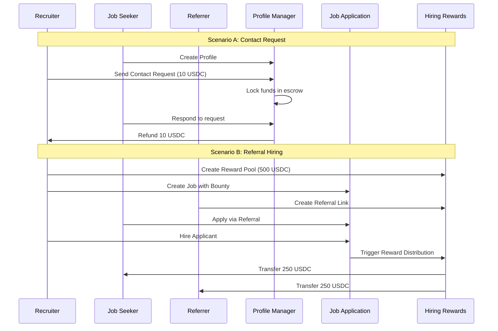

# Solana Hiring Platform

A decentralized hiring platform built on Solana blockchain, enabling job seekers, recruiters, and referrers to interact through smart contracts with built-in reward mechanisms and escrow systems.

## 🏗️ Architecture Overview

This platform consists of 5 interconnected Solana programs:

```
┌─────────────────┐    ┌─────────────────┐    ┌─────────────────┐
│ Profile Manager │    │ Job Application │    │ Hiring Rewards  │
│                 │    │                 │    │                 │
│ • User profiles │◄──►│ • Job postings  │◄──►│ • Reward pools  │
│ • Contact req.  │    │ • Applications  │    │ • Referrals     │
│ • Escrow system │    │ • Bounty system │    │ • Distribution  │
└─────────────────┘    └─────────────────┘    └─────────────────┘
         │                       │                       │
         └───────────────────────┼───────────────────────┘
                                 │
        ┌─────────────────┐     │     ┌─────────────────┐
        │ Contact Gate    │     │     │ Resume Market   │
        │                 │     │     │                 │
        │ • Access ctrl   │◄────┼────►│ • NFT resumes   │
        │ • Permissions   │     │     │ • Verification  │
        │ • Gating logic  │     │     │ • Marketplace   │
        └─────────────────┘     │     └─────────────────┘
                                │
                    ┌───────────────────┐
                    │   Token Program   │
                    │   (USDC/SPL)     │
                    └───────────────────┘
```

## 📁 Project Structure

```
Program_sequence/
├── programs/                    # Solana programs
│   ├── profile-manager/         # User profiles & contact requests
│   │   ├── src/
│   │   │   ├── lib.rs
│   │   │   ├── instructions/
│   │   │   │   ├── profile.rs   # Profile creation/update
│   │   │   │   ├── contact.rs   # Contact requests & escrow
│   │   │   │   ├── nft.rs       # NFT operations
│   │   │   │   └── payment.rs   # Payment processing
│   │   │   ├── state.rs         # Account structures
│   │   │   └── errors.rs        # Custom errors
│   │   └── Cargo.toml
│   │
│   ├── job-application/         # Job postings & applications
│   │   ├── src/
│   │   │   ├── lib.rs
│   │   │   ├── instructions/
│   │   │   │   ├── job.rs       # Job creation with bounty
│   │   │   │   ├── application.rs # Application submission & hiring
│   │   │   │   └── referral.rs  # Referral link management
│   │   │   ├── state.rs
│   │   │   ├── errors.rs
│   │   │   └── events.rs        # Event emissions
│   │   └── Cargo.toml
│   │
│   ├── hiring-rewards/          # Reward system & distribution
│   │   ├── src/
│   │   │   ├── lib.rs
│   │   │   ├── instructions/
│   │   │   │   ├── create_pool.rs # Reward pool creation
│   │   │   │   ├── deposit.rs     # USDC deposits
│   │   │   │   ├── distribute.rs  # Reward distribution (50/50)
│   │   │   │   └── referral.rs    # Referral system
│   │   │   ├── state.rs
│   │   │   └── errors.rs
│   │   └── Cargo.toml
│   │
│   ├── contact-gate/            # Access control & permissions
│   │   ├── src/
│   │   │   └── lib.rs
│   │   └── Cargo.toml
│   │
│   └── resume-marketplace/      # NFT resume marketplace
│       ├── src/
│       │   └── lib.rs
│       └── Cargo.toml
│
├── tests/                       # Integration tests
│   ├── scenarios-a-and-b-test.ts # End-to-end scenarios
│   ├── phase2-test.ts
│   └── phase3-test.ts
│
├── target/                      # Compiled programs
│   ├── deploy/                  # Program binaries (.so files)
│   ├── idl/                     # Interface definitions
│   └── types/                   # TypeScript types
│
├── config/
│   └── Anchor.toml              # Anchor configuration
│
├── docs/
│   ├── idea_scenarios.md
│   └── program-deployment-status.md
│
├── migrations/                  # Database migrations
├── package.json                 # Node.js dependencies
├── tsconfig.json               # TypeScript configuration
├── Cargo.toml                  # Workspace configuration
└── backend-integration-plan.md # Backend integration guide
```

## 🎯 Core Features

### 📋 Profile Manager
- **User Profiles**: Comprehensive skill-based profiles stored on-chain
- **Contact Requests**: Pay-to-contact system with escrow protection
- **Pricing Models**: Flexible contact pricing (consultation, hourly rates)
- **Escrow System**: Automatic refund/payment based on response

### 💼 Job Application System
- **Job Postings**: On-chain job creation with bounty escrow
- **Application Flow**: Decentralized application submission
- **Bounty Management**: Automatic bounty distribution upon hiring
- **Hiring Process**: Streamlined hiring with instant payments

### 🎁 Hiring Rewards
- **Reward Pools**: USDC-based reward pools for successful hires
- **Referral System**: Trackable referral links with attribution
- **50/50 Distribution**: Automatic reward split between referrer and candidate
- **Multi-tier Rewards**: Configurable reward tiers based on role/difficulty

### 🔐 Access Control (Contact Gate)
- **Permission Management**: Fine-grained access control
- **Contact Verification**: Verified contact interactions
- **Privacy Protection**: Selective information disclosure

### 🏆 Resume Marketplace
- **NFT Resumes**: Verified skill credentials as NFTs
- **Skill Verification**: Blockchain-based skill attestation
- **Marketplace**: Tradeable resume/skill tokens

## 🚀 Quick Start

### Prerequisites
- [Rust](https://rustlang.org) (latest stable)
- [Solana CLI](https://docs.solana.com/cli/install-solana-cli-tools) (v1.17+)
- [Anchor Framework](https://www.anchor-lang.com/docs/installation) (v0.29+)
- [Node.js](https://nodejs.org) (v18+)

### Installation

1. **Clone the repository**
   ```bash
   git clone <repository-url>
   cd Program_sequence
   ```

2. **Install dependencies**
   ```bash
   npm install
   ```

3. **Build programs**
   ```bash
   anchor build
   ```

4. **Set up local validator**
   ```bash
   # Terminal 1: Start local validator
   solana-test-validator --reset

   # Terminal 2: Deploy programs
   anchor deploy
   ```

5. **Run tests**
   ```bash
   # Run all tests
   anchor test

   # Run specific scenario tests
   ANCHOR_PROVIDER_URL=http://localhost:8899 ANCHOR_WALLET=~/.config/solana/id.json npx ts-mocha -p ./tsconfig.json tests/scenarios-a-and-b-test.ts --timeout 60000
   ```

## 🧪 Test Scenarios

### Scenario A: Outbound Sourcing
1. **Profile Creation**: Job seeker creates skill-based profile
2. **Contact Request**: Recruiter sends paid contact request (10 USDC escrow)
3. **Response**: Job seeker responds, recruiter gets refund

### Scenario B: Inbound Application with Referral
1. **Reward Pool**: Recruiter creates USDC reward pool (500 USDC)
2. **Job Posting**: Job created with bounty escrow
3. **Referral**: Referrer creates referral link for job seeker
4. **Application**: Job seeker applies via referral link
5. **Hiring**: Upon hiring, 250 USDC goes to job seeker, 250 USDC to referrer

## 🔧 Configuration

### Network Configuration
```toml
# Anchor.toml
[features]
resolution = true
skip-lint = false

[programs.localnet]
profile_manager = "9KWbRGWmoX7JVKkeR5XGQhJDGxki15NeFZdkqb5U1MFu"
job_application = "2qABiq2mqKPrp8H2eFqshFZ4EjTYMHPcmepnHD4TuwgN"
hiring_rewards = "HQAgXyTzVkb7nPcULH8BbigDFR1Wc8mQWrG2Su3UeD9b"
contact_gate = "Dp7V95LBVp5Y6YVzYTfgrD2PKgXCgYXqw69QT4DqZoP6"
resume_marketplace = "9DWZHxCyaPDRj6mWAKP5nMLVBcSL7thyb38RjnEzmnE8"

[provider]
cluster = "localnet"
wallet = "~/.config/solana/id.json"
```

## 💰 Token Economics

- **Payment Token**: USDC (SPL Token)
- **Contact Fees**: Configurable per profile (e.g., 10 USDC)
- **Bounty Escrow**: Job-specific bounty amounts
- **Reward Distribution**: 50% referrer, 50% candidate
- **Platform Fees**: Optional, configurable per transaction

## 🔗 Program Interactions



## 🛠️ Development

### Running Local Development
```bash
# Start local validator
solana-test-validator --reset

# Watch for file changes and rebuild
anchor build --watch

# Run tests in watch mode
npm run test:watch
```

### Program Deployment
```bash
# Deploy to devnet
anchor deploy --provider.cluster devnet

# Deploy to mainnet
anchor deploy --provider.cluster mainnet-beta
```

## 📚 API Documentation

### Key Instructions

#### Profile Manager
- `create_profile(skills, experience, region, bio, handle, contact_options, hourly_rate)`
- `send_contact_request(message, contact_option_index)`
- `respond_to_contact(accept: bool)`

#### Job Application
- `create_job(title, description, skills, salary_range, deadline, bounty)`
- `apply_to_job(cover_letter, referral_link_id?)`
- `hire_applicant(tier_index)`

#### Hiring Rewards
- `create_reward_pool(reward_tiers)`
- `deposit_to_pool(amount)`
- `create_referral(referee)`
- `distribute_reward(tier_index)`

## 🤝 Contributing

1. Fork the repository
2. Create your feature branch (`git checkout -b feature/amazing-feature`)
3. Commit your changes (`git commit -m 'Add amazing feature'`)
4. Push to the branch (`git push origin feature/amazing-feature`)
5. Open a Pull Request

## 📝 License

This project is licensed under the MIT License - see the [LICENSE](LICENSE) file for details.

## 🔗 Links

- [Solana Documentation](https://docs.solana.com/)
- [Anchor Framework](https://www.anchor-lang.com/)
- [SPL Token Program](https://spl.solana.com/token)

## 📧 Contact

For questions or support, please open an issue in this repository.

---

**⚠️ Disclaimer**: This is experimental software. Use at your own risk on mainnet.